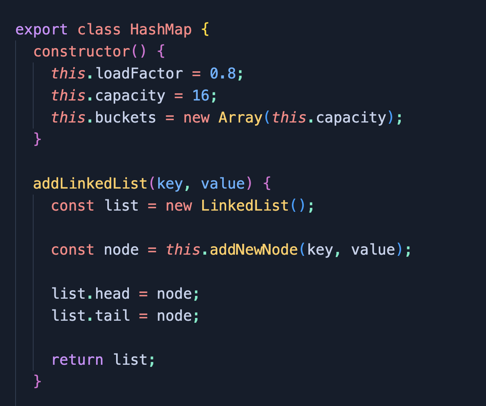
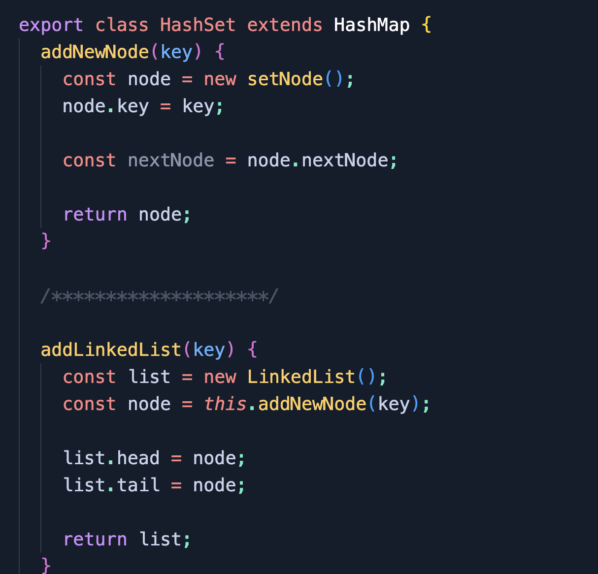

# #️⃣ 🗺️ HashMap/HashSet Mini Project

## 🗣️ Description

Custom HashMap and HashSet created for The Odin Project curriculum.

This Hashmap employs JavaScript classes to create a robust HashMap with multiple methods.

The HashSet class extends from the HashMap class and overrides HashMap methods to deal with 'keys' only, rather than 'key/value' pairs.

## 💻 Technologies Used

- JavaScript

## 👨‍🔬 HashMap Methods

1. `hash(key)` takes a key and produces a hash code with it
2. `set(key, value)` takes two arguments: the first is a key, and the second is a value that is assigned to this key. If a key already exists, then the old value is overwritten, and we can say that we update the key’s value. If this key's hash is to be stored in a bucket that doesn't yet exist, a new linked list is created to accomodate the key/value pair.
3. `get(key)` get(key) takes one argument as a key and returns the value that is assigned to this key. If a key is not found, return null.
4. `has(key)` takes a key as an argument and returns true or false based on whether or not the key is in the hash map.
5. `remove(key)` takes a key as an argument. If the given key is in the hash map, it should remove the entry with that key and return true. If the key isn’t in the hash map, it should return false.
6. `length()` returns the number of stored keys in the hash map.
7. `clear()` removes all entries in the hash map.
8. `keys()` returns an array containing all the keys inside the hash map.
9. `values()` returns an array containing all the values.
10. `entries()` returns an array that contains each `key, value` pair. Example: `[[firstKey, firstValue], [secondKey, secondValue]]`

Please Note: The above descriptions are a direct reflection of The Odin Project's "HashMap" prompt - found [here](https://www.theodinproject.com/lessons/javascript-hashmap).

## 👩‍🔬 HashSet Methods

As HashSets only store keys (rather than key/value pairs), the following methods have been modified to reflect this change:

- `set(key)` / `changeCapacity`
- `get(key)` - now throws error as it is built to return a `value`
- `values()` - now throws error as it is built to return all `values`
- `entries()` - now throws error as it is meant to return `key/value` pairs

## Screenshot:

